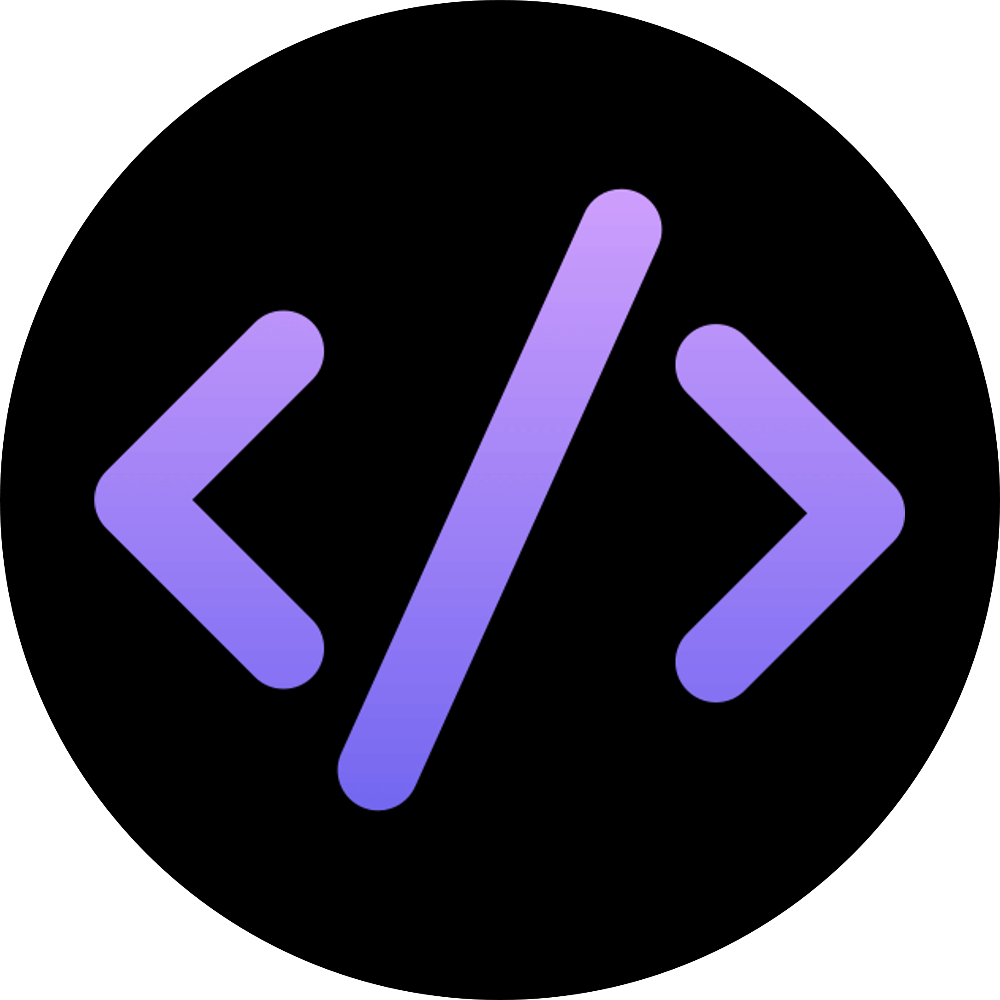
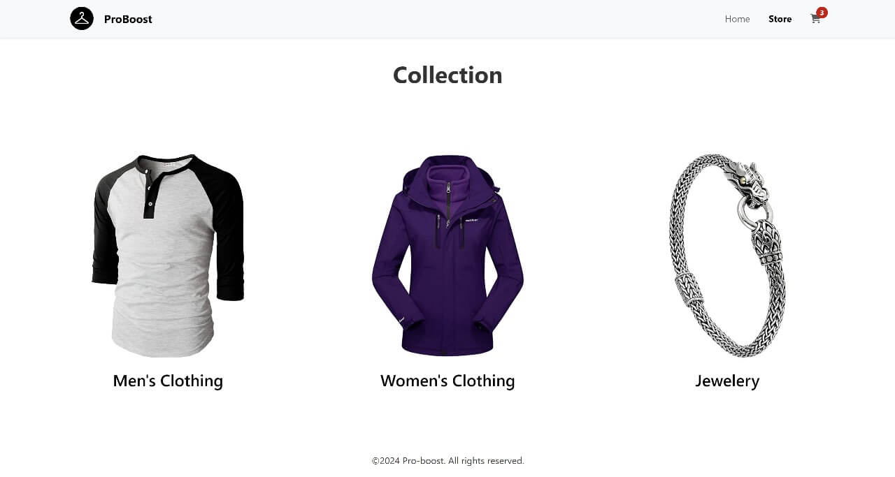
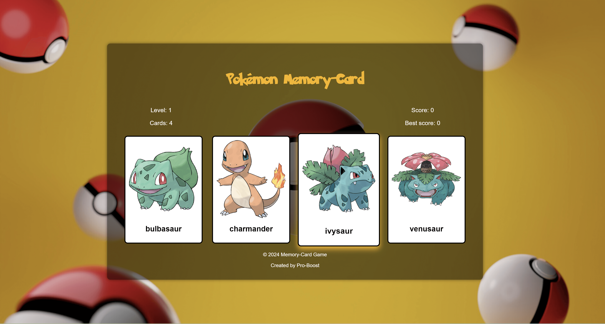

# Hi there, I'm Mohamed-B AKA Pro-Boost! 👋

{:width="200px"}

## About Me 🚀

I'm a passionate **Front-End Web Developer** with experience in **React, TypeScript, Tailwind CSS, Bootstrap**, and building interactive, performant user interfaces. I enjoy turning ideas into sleek, responsive products.

- 🌱 Currently learning: **Next.js**
- 🔭 Working on: **A military/camping clothing store project**
- 📫 Reach me at: **contact@mohamed-b.com**
- ⚡ Fun fact: **I started coding by customizing game interfaces — now I build full web apps!**

## Programming Languages 💻

## Spoken Languages 🌍

- English
- French
- Japanese
- Abaric

## Featured Projects 💼

### [Portfolio Website](https://github.com/pro-boost/glow-folio-darklight-magic)

A dark/light-themed personal portfolio built with **React, Tailwind CSS**, and **React Router**. It's responsive, animated, and optimized for SEO and mobile.

👉 [Live at mohamed-b.com](https://mohamed-b.com)

---

### [Online Shop Project](https://github.com/pro-boost/Shoping-cart)

A fully responsive **React-based e-commerce web app** simulating a real shopping experience. Includes cart functionality, product filtering, and UI state handling.

👉 [View the repo](https://github.com/pro-boost/Shoping-cart)

---

### [Pokémon Memory Game](https://github.com/pro-boost/Memory_card)

A card-matching memory game built with **React**, featuring Pokémon data from an external API. Uses React hooks for game logic, score tracking, and level progression.

👉 [View the repo](https://github.com/pro-boost/Memory_card)

## Get in Touch 📬

- 🌐 [mohamed-b.com](https://mohamed-b.com)
- 💼 [LinkedIn](https://www.linkedin.com/in/mohamed-b-96378b324/?profileId=ACoAAFH8K5sBSvKSjh8yYpw4efFrO28146SkVmE)
- 🐦 [X / Twitter](https://x.com/Pro_boost_)
- 📧 Email: **contact@mohamed-b.com**
