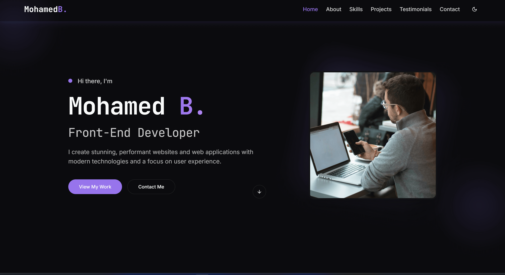
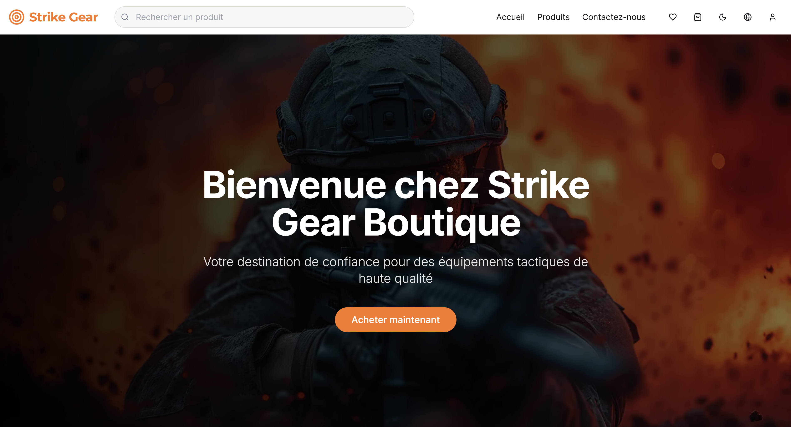

# Hi there, I'm Mohamed-B AKA Pro-Boost! 👋

## About Me 🚀

I'm a passionate **Front-End Web Developer** with experience in **React, NextJs, TypeScript, Tailwind CSS**, and building interactive, performant user interfaces. I enjoy turning ideas into sleek, responsive products.

- 🌱 Currently learning: **React Native**
- 🔭 Working on: **An Advanced Panorama Viewer**
- 📫 Reach me at: **contact@mohamed-b.com**
- ⚡ Fun fact: **I started coding by customizing game interfaces — now I build full web apps!**

## Programming Languages & Skills 💻

## Spoken Languages 🌍

- English
- French
- Japanese
- Abaric

## Featured Projects 💼

### [Portfolio Website](https://github.com/pro-boost/My_Portfolio)

A dark/light-themed personal portfolio built with **React, Tailwind CSS**, and **React Router**. It's responsive, animated, and optimized for SEO and mobile.

👉 [Live at mohamed-b.com](https://mohamed-b.com)

---

### [MegaTech Formations](https://github.com/pro-boost/formation-locale-architect)

A modern, multilingual professional training platform built with **React, TypeScript, and Supabase**. Specializing in Health, Safety & Environment (HSE), Project Management, and Mining Operations training programs.

👉 [Live at megatech-formations.netlify.app](https://megatech-formations.netlify.app/)

---

### [Strike Gear](https://github.com/pro-boost/Strike-Gear)

a modern e-commerce platform tailored for outdoor enthusiasts. Built with **cutting-edge technologies**, it offers a seamless shopping experience with a focus on performance and scalability.

👉 [Live at strike-gear.netlify.app](https://strike-gear.netlify.app/)

---

### [CineScope](https://github.com/pro-boost/alx-project-nexus)

A modern, responsive movie discovery application built with **Next.js and TypeScript**. CineScope allows users to search for movies, browse by genres, manage favorites, and discover trending content using The Movie Database (TMDB) API.

👉 [Live at my-cinescope.vercel.app](https://my-cinescope.vercel.app/)

## Get in Touch 📬

- 🌐 [mohamed-b.com](https://mohamed-b.com)
- 💼 [LinkedIn](https://www.linkedin.com/in/mohamed-brk/)
- 🐦 [X / Twitter](https://x.com/Pro_boost_)
- 📧 Email: **contact@mohamed-b.com**
